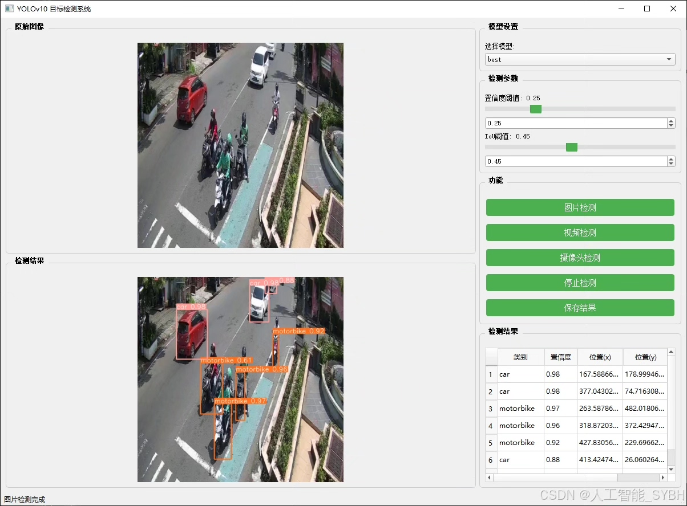
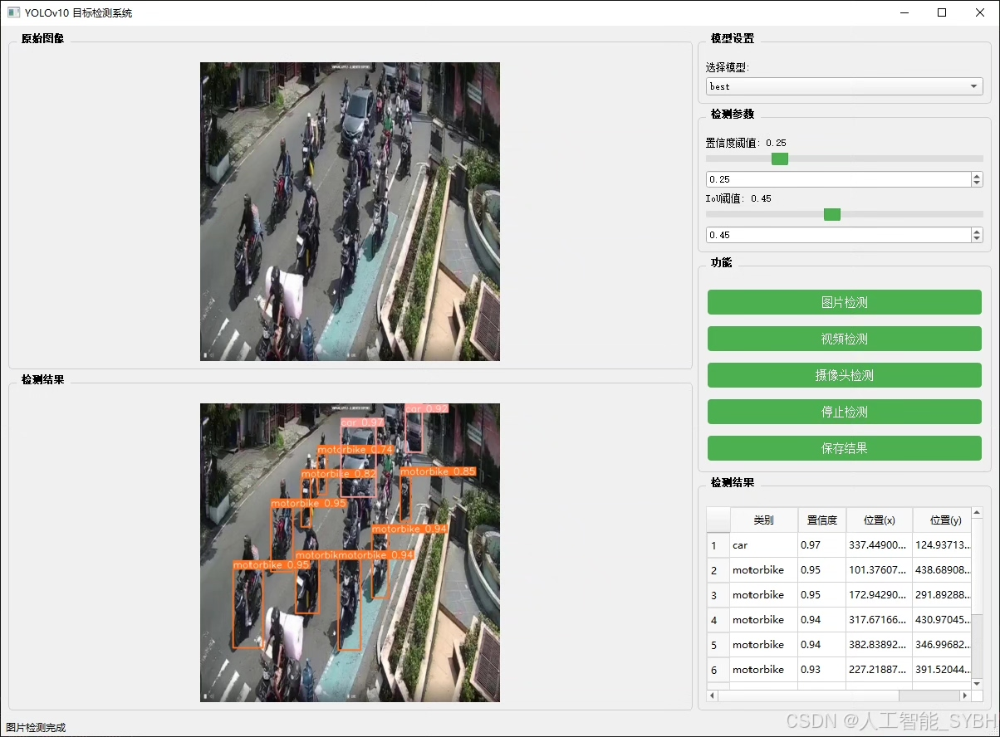
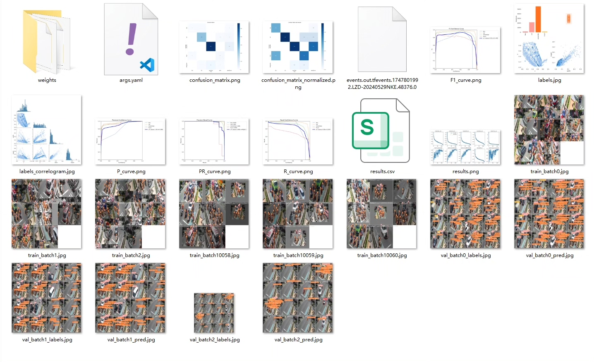
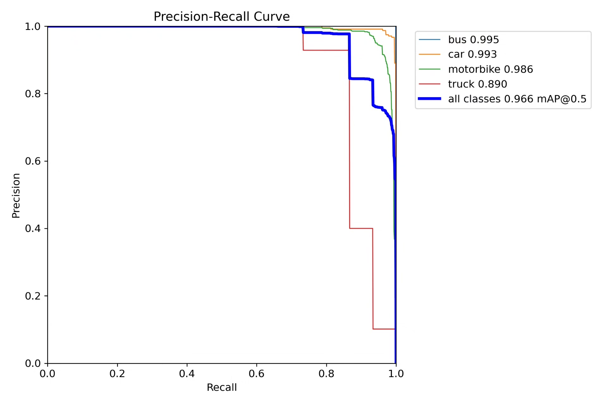
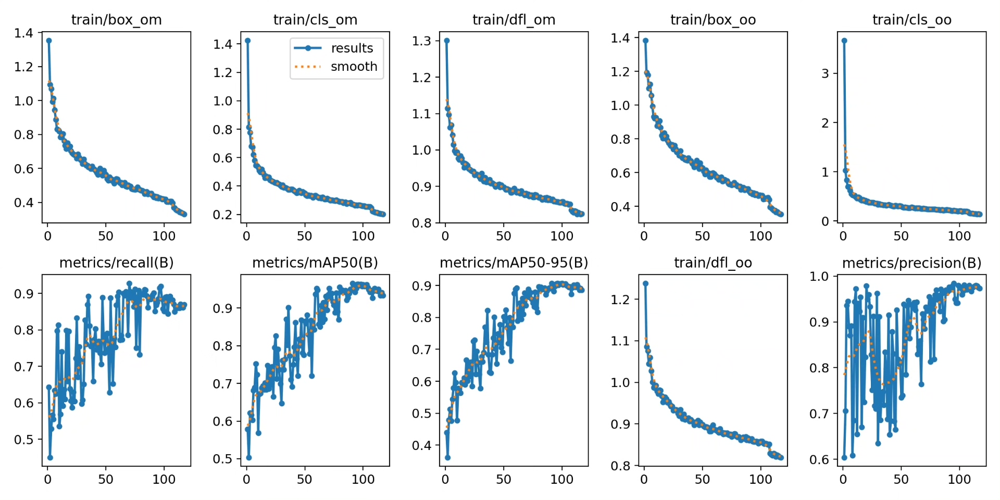
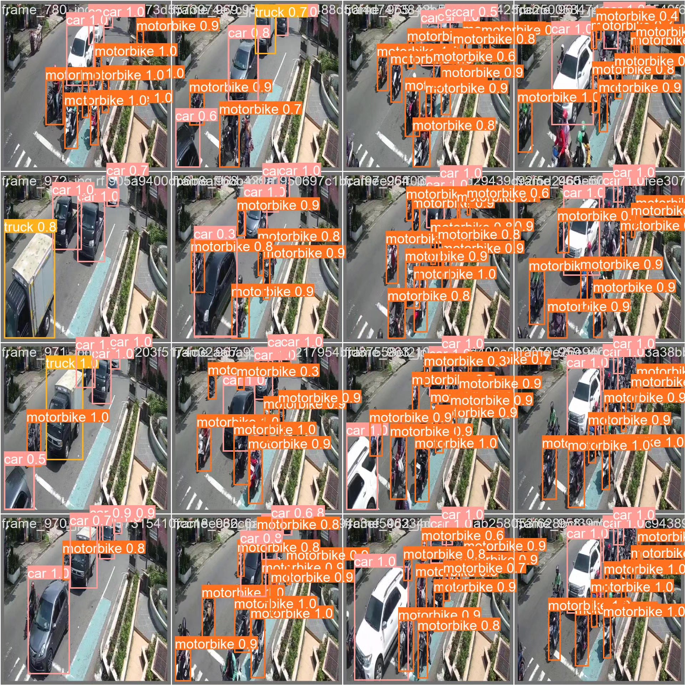
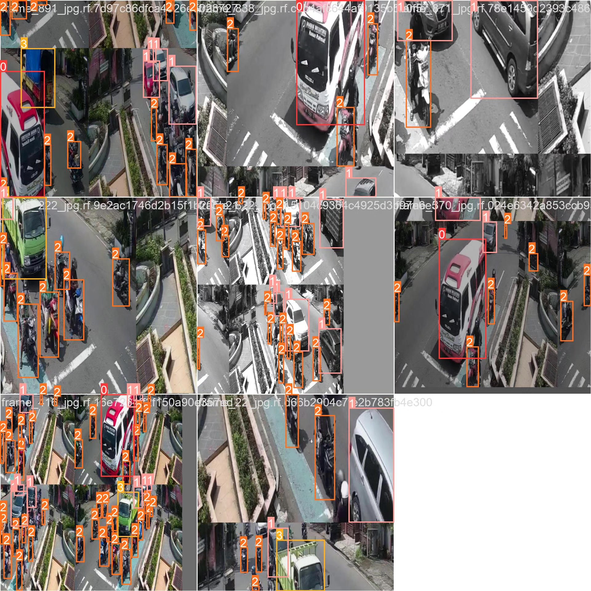

# Vehicle recognition detection system based on deep learning YOLOv10

## Body

Based on the YOLOv10 object detection algorithm, this project has developed an efficient vehicle recognition and detection system. It is specifically designed for identifying and classifying four common vehicle types: buses, cars, motorcycles, and trucks. The system uses a custom dataset containing 1000 images for training and evaluation, with 750 images in the training set, 100 in the validation set, and 150 in the test set. By optimizing the network structure and training strategy of YOLOv10, this project has achieved high-precision real-time detection of multiple classes of vehicles under complex traffic scenarios, providing reliable technical support for intelligent transportation management, autonomous driving assistance systems, and other applications.

The company's products have obtained the official commercial license certification from YOLO.

We provide after-sales service.

After payment, we will provide WeChat ID to answer questions at any time.

Environment configuration: We will provide a tutorial on environment configuration, and WeChat will provide answers to questions.

Remote installation service: If you need remote configuration, an additional fee of 69 is required, and if the configuration fails, all fees will be refunded (only the installation fee is refunded for special old computers).

Retraining dataset: After configuring the environment, you can train on your own computer. If you need us to retrain, just pay 69 plus computing power fees (2.5 yuan/hour).

Full after-sales service

## Images

## Payment

Here is a pay link on Stripe ( https://buy.stripe.com/3cs8yP7sY87d0vu9AB ). Please contact me lonlonago@foxmail.com after funding $89, and I will send you a complete data files , thank you!

